# Complete E2E Development Workflow

[](https://undeadlist.com)

## For Solo Dev Startups Using Claude Code Agents



> **Target User:** Solo dev running a startup, only engineer, entire company.
> **Goal:** Pull this repo into any project and have a full agent team ready to go.
> **Built by:** Paul @ UndeadList — learned the hard way what works.

---

## The Reality Check

You're a solo dev. You don't have:
- A QA team
- A code reviewer
- A DevOps engineer
- Time to waste on AI agents going rogue

This workflow package gives you all of that via Claude Code subagents, with strict protocols to prevent the bullshit that wastes your time.

---

## What's In This Repo

```
claude-code-agents/
├── .claude/
│   └── agents/
│       ├── # AUDIT AGENTS (run in parallel)
│       ├── code-auditor.md         # Code quality, DRY, complexity
│       ├── bug-auditor.md          # Security vulns, auth gaps
│       ├── security-auditor.md     # OWASP deep scan
│       ├── doc-auditor.md          # Documentation gaps
│       ├── infra-auditor.md        # Config, env vars, headers
│       ├── ui-auditor.md           # Accessibility, UX
│       │
│       ├── # FIX AGENTS
│       ├── fix-planner.md          # Prioritizes findings into FIXES.md
│       ├── code-fixer.md           # Implements fixes
│       ├── test-runner.md          # Validates fixes
│       │
│       ├── # BROWSER AGENTS (Chrome integration)
│       ├── browser-qa-agent.md     # Navigates UI, finds console errors
│       ├── fullstack-qa-orchestrator.md  # Find → Fix → Verify loop
│       ├── console-monitor.md      # Real-time console watching
│       ├── visual-diff.md          # Screenshot comparison
│       │
│       └── # SUPERVISORS
│       └── architect-reviewer.md   # Oversees until production-ready
│
├── CLAUDE.md.template              # Project config (customize per project)
├── setup-project.sh                # One command setup for new projects
├── install.sh                      # Quick agent install
└── README.md
```

---

## Project Lifecycle

### Phase 0: New Project Setup

```bash
# Option A: Full setup (creates CLAUDE.md, detects stack)
curl -s https://undeadlist.com/agents/setup.sh | bash

# Option B: Just agents
curl -s https://undeadlist.com/agents/install.sh | bash

# Option C: Via npm
npx claude-code-agents
```

This creates:
- `.claude/agents/` with all agent definitions
- `.claude/audits/` for generated reports (gitignored)
- `CLAUDE.md` with your project config

### Phase 1: Skeleton/Scaffolding

**Before touching code, create your blueprint:**

```
claude "Create a SETUP_BLUEPRINT.md for this project:
- Folder structure
- Tech stack decisions (with rationale)
- Dependencies list (don't install yet)
- Environment variables needed
- Database planning
- Success criteria checklist

Do NOT generate any code. Just the plan."
```

**Key decisions to document:**
- Monorepo vs separate repos
- Database: SQLite dev → Postgres prod
- Auth approach
- API framework
- Frontend framework

### Phase 2: Initial Build

**Strict rules for AI agents during build:**

```markdown
## RULES FOR THIS SESSION

1. **ASK BEFORE** modifying any file not directly related to current task
2. **NEVER** refactor "while you're in there"
3. **NEVER** update dependencies unless explicitly requested
4. **NEVER** change config files without approval
5. **ONE logical change per commit**
6. **VERIFY** the build works after each change
```

**Use checkpoints:**
```
claude "Implement [feature].
CHECKPOINT after each file change.
Show me what you changed before proceeding."
```

### Phase 3: Development Loop

The core loop for any task:

```
┌─────────────────────────────────────────────────┐
│  1. Understand the task                         │
│  2. State what files you'll touch               │
│  3. Get approval                                │
│  4. Make ONE change                             │
│  5. Verify it works                             │
│  6. Commit                                      │
│  7. Repeat                                      │
└─────────────────────────────────────────────────┘
```

**Never let the agent:**
- Make multiple changes at once
- "Improve" things not in scope
- Skip verification
- Claim success without testing

### Phase 4: Pre-Launch Audit

Run the full parallel audit:

```
claude "Run parallel audit:
- code-auditor on src/
- bug-auditor on src/
- security-auditor on src/api/
- doc-auditor on src/
- infra-auditor on .env and config files
- ui-auditor on src/components/

Then use fix-planner to create FIXES.md"
```

**Review `.claude/audits/` for:**
- AUDIT_CODE.md
- AUDIT_SECURITY.md
- AUDIT_DOCS.md
- FIXES.md (prioritized action items)

### Phase 5: Browser QA

Enable Chrome integration:
```
/chrome
```

Run the full QA loop:
```
claude "Use fullstack-qa-orchestrator to:
1. Start dev server (npm run dev)
2. Navigate to http://localhost:3000
3. Test: homepage, auth flow, main features
4. Find console errors, UI bugs
5. Fix issues found
6. Re-test to verify
7. Repeat until clean"
```

### Phase 6: Deploy

**Pre-deploy checklist:**
```
claude "Pre-deploy verification:
1. All TypeScript compiles (pnpm tsc --noEmit)
2. All tests pass (pnpm test)
3. No console errors in browser
4. Build succeeds (pnpm build)
5. All env vars documented
6. Database migrations ready

Report status of each."
```

---

## The Protocols

### Protocol 1: No Unauthorized Changes

Every AI agent must follow:

```markdown
## BEFORE ANY CHANGE

1. State what file you're modifying
2. State what change you're making
3. State why
4. Wait for "PROCEED" or "STOP"

## FORBIDDEN ACTIONS

- ❌ npm install / npx anything without approval
- ❌ Modifying package.json without approval
- ❌ Creating new files when editing existing works
- ❌ Refactoring unrelated code
- ❌ "Improvements" not requested
- ❌ Touching config files without approval
```

### Protocol 2: Micro-Checkpoint Method

For complex changes, use the architect-verified approach:

```markdown
## EVERY PHASE:

1. Agent states planned change
2. Agent calls architect-reviewer for verification
3. User says "PROCEED" or "STOP"
4. Agent makes ONE change
5. Agent verifies change applied correctly
6. Agent calls architect-reviewer again
7. Proceed to next phase only with approval
```

### Protocol 3: Regression Prevention

Before any change:

```bash
# Baseline testing
curl -s http://localhost:3000/api/health  # API works
pnpm tsc --noEmit                          # TypeScript valid
pnpm test                                   # Tests pass

# After change
# Run same commands - all must still work
```

### Protocol 4: Browser QA Verification

For any UI change:

```markdown
1. Start dev server
2. Navigate to affected page
3. Check console for errors
4. Test the specific interaction
5. Verify no regressions
6. Only then claim "done"
```

---

## CLAUDE.md Template

Every project needs this at root:

```yaml
# CLAUDE.md

## PROJECT CONFIG
project_name: "YOUR_PROJECT"
dev_server_cmd: "pnpm dev"
dev_url: "http://localhost:3000"
tech_stack:
  - TypeScript
  - React/Next.js
  - Node.js
  - Prisma
test_flows:
  - "Homepage load"
  - "User auth"
  - "Main feature"

## CORE RULES (NON-NEGOTIABLE)

1. **No Unauthorized Changes**
   - ASK BEFORE modifying files not directly related to task
   - NEVER refactor "while you're in there"
   - NEVER update dependencies unless requested

2. **Follow Existing Patterns**
   - Match codebase style exactly
   - Grep for examples before creating new patterns
   - New code should be indistinguishable from existing

3. **Verify Before Claiming Done**
   - Run dev server after changes
   - Check for TypeScript/lint errors
   - Test the actual UI if UI was touched
   - Run relevant tests

4. **Communication**
   - State what you're going to do
   - List files you'll touch
   - Report significant decisions
   - Ask if you hit ambiguity

## FORBIDDEN ACTIONS

- ❌ npm install without approval
- ❌ Modifying package.json without approval
- ❌ Windows paths (use Unix paths)
- ❌ Creating files when editing works
- ❌ Skipping verification
- ❌ Multiple changes in one step

## AGENT USAGE

Quick audit: "Run parallel audit on src/"
Browser QA: "Use browser-qa-agent to test localhost:3000"
Full loop: "Use fullstack-qa-orchestrator for complete QA"
Pre-PR: "Use architect-reviewer to verify production-ready"
```

---

## Common Commands

### Daily Development

```bash
# Start coding session
claude "Review CLAUDE.md, then help me with [task]"

# Quick check before commit
claude "Check src/ for any obvious issues before I commit"

# Verify a specific file
claude "Review [file] for bugs, especially [concern area]"
```

### Pre-Launch

```bash
# Full audit
claude "Run full parallel audit on src/, create FIXES.md"

# Browser QA
claude "Enable /chrome, then use fullstack-qa-orchestrator
to test http://localhost:3000 - all user flows"

# Security focus
claude "Use security-auditor to deep scan src/api/ for vulnerabilities"
```

### Debugging

```bash
# Console monitoring
claude "Use console-monitor to watch http://localhost:3000
while I test - report errors in real-time"

# Specific bug
claude "Navigate to [URL], reproduce [issue],
check console, identify root cause, propose fix"
```

---

## When AI Goes Rogue

### Red Flags - STOP Immediately

- Agent makes changes without asking
- Agent installs packages without approval
- Agent modifies config files unexpectedly
- Agent claims success without verification
- Agent skips checkpoints
- Agent touches files outside scope

### Recovery Commands

```bash
# Revert last change
git checkout -- [file]

# Revert all changes
git reset --hard HEAD

# Check what changed
git diff

# Restore from backup
cp [file].backup [file]
```

### Enforcement Phrases

```
"STOP. You didn't ask permission."

"STOP. That's not in scope. Show me where I requested that."

"STOP. Verify it works before claiming done."

"STOP. Use the architect tool for verification."

"STOP. One change at a time."
```

---

## The Solo Dev Reality

You're the:
- Product manager
- Designer
- Frontend dev
- Backend dev
- DevOps
- QA
- Support
- Marketing
- Sales

This workflow exists because:
1. You don't have time for AI agents to waste
2. You can't afford production bugs
3. You need consistency across projects
4. You need to move fast without breaking things

The agents are your team. But they need strict protocols or they'll burn your time.

---

## Quick Reference

| Task | Command |
|------|---------|
| New project setup | `curl -s https://undeadlist.com/agents/setup.sh \| bash` |
| Enable browser QA | `/chrome` in Claude Code |
| Run parallel audit | `"Run parallel audit on src/"` |
| Browser test | `"Use browser-qa-agent to test localhost:3000"` |
| Full QA loop | `"Use fullstack-qa-orchestrator..."` |
| Verify production-ready | `"Use architect-reviewer..."` |

---

## Files Generated

All reports go to `.claude/audits/` (gitignored):

| File | Content |
|------|---------|
| AUDIT_CODE.md | Code quality issues |
| AUDIT_SECURITY.md | Vulnerabilities |
| AUDIT_DOCS.md | Documentation gaps |
| AUDIT_INFRA.md | Config issues |
| AUDIT_UI_UX.md | Accessibility/UX |
| AUDIT_BROWSER_QA.md | Console errors, UI bugs |
| FIXES.md | Prioritized fix plan |
| QA_SESSION_LOG.md | Full session transcript |

---

## Contributing

Found a better protocol? Agent that should exist?

PR it: https://github.com/undeadlist/claude-code-agents

---

## License

MIT. Use it, fork it, enhance it.

---

**Built by [UndeadList](https://undeadlist.com)**
*The indie software flea market*

---

*"Built, but undiscovered."*
