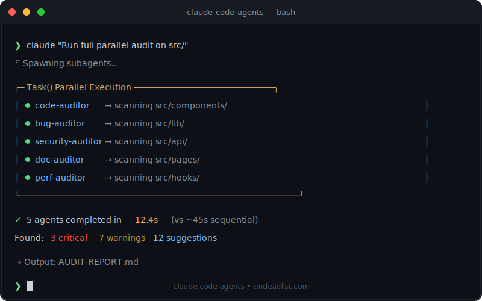

# Complete E2E Development Workflow

[](https://undeadlist.com) [](https://github.com/hesreallyhim/awesome-claude-code)

## For Solo Dev Startups Building with Next.js + Claude Code



> **Target User:** Solo dev running a startup, only engineer, entire company.
> **Goal:** Pull this repo into any project and have a full agent team ready to go.
> **Designed for:** Next.js / React / TypeScript full-stack web apps (Prisma, npm/pnpm, Vercel).
> Other stacks can adapt the agent prompts, but examples and tooling defaults target this stack.
> **Built by:** Paul @ UndeadList — learned the hard way what works.

---

## The Reality Check

You're a solo dev. You don't have:
- A QA team
- A code reviewer
- A DevOps engineer
- Time to waste on AI agents going rogue

This workflow package gives you all of that via Claude Code subagents, with strict protocols to prevent the bullshit that wastes your time.

---

## What's In This Repo

```
claude-code-agents/
├── .claude-plugin/
│   ├── plugin.json                 # Plugin manifest
│   └── marketplace.json            # Marketplace config
│
├── agents/                         # 24 agent definitions
│   ├── # AUDIT AGENTS (11 - run in parallel)
│   ├── code-auditor.md             # Code quality, DRY, complexity
│   ├── bug-auditor.md              # Runtime bugs, auth gaps
│   ├── security-auditor.md         # OWASP deep scan
│   ├── doc-auditor.md              # Documentation gaps
│   ├── infra-auditor.md            # Config, env vars, headers
│   ├── ui-auditor.md               # Accessibility, UX
│   ├── db-auditor.md               # Database, N+1, indexes
│   ├── perf-auditor.md             # Performance, bundle size
│   ├── dep-auditor.md              # Dependencies, vulnerabilities
│   ├── seo-auditor.md              # SEO, meta tags, OpenGraph
│   ├── api-tester.md               # API endpoint testing
│   ├── # FIX/IMPLEMENT AGENTS (4)
│   ├── fix-planner.md              # Prioritizes findings into FIXES.md
│   ├── code-fixer.md               # Implements fixes
│   ├── test-runner.md              # Validates fixes
│   ├── test-writer.md              # Auto-generates tests
│   ├── # BROWSER AGENTS (4 - Chrome integration)
│   ├── browser-qa-agent.md         # Navigates UI, finds console errors
│   ├── fullstack-qa-orchestrator.md  # Find → Fix → Verify loop
│   ├── console-monitor.md          # Real-time console watching
│   ├── visual-diff.md              # Screenshot comparison
│   ├── # DEPLOY AGENTS (2)
│   ├── deploy-checker.md           # Pre-deployment validation
│   ├── env-validator.md            # Environment configuration
│   ├── # UTILITY AGENTS (2)
│   ├── pr-writer.md                # PR description generator
│   ├── seed-generator.md           # Test data creation
│   └── # SUPERVISORS (1)
│   └── architect-reviewer.md       # Oversees until production-ready
│
├── skills/                         # 6 workflow skills (slash commands)
│   ├── full-audit.md               # /full-audit
│   ├── pre-commit.md               # /pre-commit
│   ├── pre-deploy.md               # /pre-deploy
│   ├── new-feature.md              # /new-feature
│   ├── bug-fix.md                  # /bug-fix
│   └── release-prep.md             # /release-prep
│
├── workflows/                      # Detailed workflow documentation
│   ├── pre-commit.md
│   ├── pre-deploy.md
│   ├── full-audit.md
│   ├── new-feature.md
│   ├── bug-fix.md
│   └── release-prep.md
│
├── CLAUDE.md                       # Orchestrator instructions
├── setup-project.sh                # One command setup for new projects
├── install.sh                      # Quick agent install (legacy)
└── README.md
```

**Total: 24 agents + 6 workflow skills**

---

## Quick Start

### Install as Plugin (Recommended)

Install once, use across all projects. No per-project file copying needed.

```bash
# Step 1: Add the marketplace (run inside Claude Code)
/plugin marketplace add undeadlist/claude-code-agents

# Step 2: Install (run in your terminal)
claude plugin install claude-code-agents@undeadlist-claude-code-agents
```

Or browse and install via the `/plugin` UI → **Discover** tab after Step 1.

All 24 agents and 6 workflow skills become natively available. Use skills like `/full-audit`, `/pre-commit`, `/pre-deploy`, etc.

### Alternative Installation (Per-Project)

If you prefer per-project installation:

```bash
# Option A: Full setup (creates CLAUDE.md, detects stack)
curl -s https://undeadlist.com/agents/setup.sh | bash

# Option B: Just agents
curl -s https://undeadlist.com/agents/install.sh | bash

# Option C: Via npm
npx claude-code-agents
```

This copies agents into your project's `.claude/agents/` directory.

---

## Stack Compatibility

These agents are optimized for **Next.js / React / TypeScript** projects using **Prisma**, **npm/pnpm**, and **Vercel**. Commands, file paths, and examples throughout the agent prompts reflect this stack.

**Stack-agnostic agents** (useful for any project):
- `security-auditor` — OWASP checks apply to any web app
- `code-auditor` — quality principles are language-agnostic
- `doc-auditor` — documentation gap analysis works everywhere
- `pr-writer` — generates PR descriptions for any git repo
- `fix-planner` — prioritization logic is framework-independent
- `architect-reviewer` — review criteria are generic

**Adapting for other stacks:** Fork the repo and edit the agent `.md` files in `agents/`. Swap Next.js-specific commands (`npm run dev`, `pnpm tsc`, `localhost:3000`) for your equivalents. The orchestration structure works regardless of stack — only the tool-specific examples need changing.

---

## Workflows

### Pre-Commit
```
claude "Run pre-commit workflow"
```
Runs code-auditor + test-runner before committing.

### Pre-Deploy
```
claude "Run pre-deploy workflow"
```
Validates build, env vars, dependencies before deployment.

### Full Audit
```
claude "Run full-audit workflow on src/"
```
All 11 auditors in parallel → fix-planner creates FIXES.md.

### New Feature
```
claude "Run new-feature workflow for: [feature description]"
```
test-writer → code-fixer → test-runner → browser-qa (TDD approach).

### Bug Fix
```
claude "Run bug-fix workflow for: [bug description]"
```
Write failing test → fix → verify (regression prevention).

### Release Prep
```
claude "Run release-prep workflow for v1.0.0"
```
Full audit → fixes → deploy validation → PR generation.

---

## Project Lifecycle

### Phase 0: New Project Setup

```bash
curl -s https://undeadlist.com/agents/setup.sh | bash
```

### Phase 1: Skeleton/Scaffolding

**Before touching code, create your blueprint:**

```
claude "Create a SETUP_BLUEPRINT.md for this project:
- Folder structure
- Tech stack decisions (with rationale)
- Dependencies list (don't install yet)
- Environment variables needed
- Database planning
- Success criteria checklist

Do NOT generate any code. Just the plan."
```

### Phase 2: Initial Build

**Strict rules for AI agents during build:**

```markdown
## RULES FOR THIS SESSION

1. **ASK BEFORE** modifying any file not directly related to current task
2. **NEVER** refactor "while you're in there"
3. **NEVER** update dependencies unless explicitly requested
4. **NEVER** change config files without approval
5. **ONE logical change per commit**
6. **VERIFY** the build works after each change
```

### Phase 3: Development Loop

The core loop for any task:

```
┌─────────────────────────────────────────────────┐
│  1. Understand the task                         │
│  2. State what files you'll touch               │
│  3. Get approval                                │
│  4. Make ONE change                             │
│  5. Verify it works                             │
│  6. Commit                                      │
│  7. Repeat                                      │
└─────────────────────────────────────────────────┘
```

### Phase 4: Pre-Launch Audit

Run the full parallel audit:

```
claude "Run full-audit workflow on src/"
```

**Review `.claude/audits/` for:**
- AUDIT_CODE.md, AUDIT_SECURITY.md, AUDIT_DB.md, AUDIT_PERF.md
- FIXES.md (prioritized action items)

### Phase 5: Browser QA

Enable Chrome integration:
```
/chrome
```

Run the full QA loop:
```
claude "Use fullstack-qa-orchestrator to:
1. Start dev server (npm run dev)
2. Navigate to http://localhost:3000
3. Test: homepage, auth flow, main features
4. Find console errors, UI bugs
5. Fix issues found
6. Re-test to verify
7. Repeat until clean"
```

### Phase 6: Deploy

```
claude "Run pre-deploy workflow"
```

---

## The Protocols

### Protocol 1: No Unauthorized Changes

Every AI agent must follow:

```markdown
## BEFORE ANY CHANGE

1. State what file you're modifying
2. State what change you're making
3. State why
4. Wait for "PROCEED" or "STOP"

## FORBIDDEN ACTIONS

- ❌ npm install / npx anything without approval
- ❌ Modifying package.json without approval
- ❌ Creating new files when editing existing works
- ❌ Refactoring unrelated code
- ❌ "Improvements" not requested
- ❌ Touching config files without approval
```

### Protocol 2: Micro-Checkpoint Method

For complex changes:

```markdown
## EVERY PHASE:

1. Agent states planned change
2. Agent calls architect-reviewer for verification
3. User says "PROCEED" or "STOP"
4. Agent makes ONE change
5. Agent verifies change applied correctly
6. Proceed to next phase only with approval
```

### Protocol 3: Regression Prevention

Before any change:

```bash
# Baseline testing
curl -s http://localhost:3000/api/health  # API works
pnpm tsc --noEmit                          # TypeScript valid
pnpm test                                   # Tests pass

# After change - all must still work
```

---

## Common Commands

### Daily Development

```bash
# Start coding session
claude "Review CLAUDE.md, then help me with [task]"

# Quick check before commit
claude "Run pre-commit workflow"

# Verify a specific file
claude "Review [file] for bugs, especially [concern area]"
```

### Pre-Launch

```bash
# Full audit
claude "Run full-audit workflow on src/"

# Browser QA
claude "Use fullstack-qa-orchestrator to test http://localhost:3000"

# Security focus
claude "Use security-auditor to deep scan src/api/"
```

### Debugging

```bash
# Console monitoring
claude "Use console-monitor to watch http://localhost:3000"

# Specific bug
claude "Run bug-fix workflow for: [bug description]"
```

---

## Files Generated

All reports go to `.claude/audits/` (gitignored):

| File | Source Agent |
|------|--------------|
| AUDIT_CODE.md | code-auditor |
| AUDIT_SECURITY.md | bug-auditor |
| AUDIT_SECURITY_DEEP.md | security-auditor |
| AUDIT_DOCS.md | doc-auditor |
| AUDIT_INFRA.md | infra-auditor |
| AUDIT_UI_UX.md | ui-auditor |
| AUDIT_DB.md | db-auditor |
| AUDIT_PERF.md | perf-auditor |
| AUDIT_DEPS.md | dep-auditor |
| AUDIT_SEO.md | seo-auditor |
| API_TEST_REPORT.md | api-tester |
| DEPLOY_CHECK.md | deploy-checker |
| ENV_REPORT.md | env-validator |
| FIXES.md | fix-planner |
| TEST_REPORT.md | test-runner |
| AUDIT_BROWSER_QA.md | browser-qa-agent |
| QA_SESSION_LOG.md | fullstack-qa-orchestrator |

---

## Quick Reference

| Task | Command |
|------|---------|
| New project setup | `curl -s https://undeadlist.com/agents/setup.sh \| bash` |
| Enable browser QA | `/chrome` in Claude Code |
| Pre-commit check | `"Run pre-commit workflow"` |
| Full audit | `"Run full-audit workflow on src/"` |
| Pre-deploy check | `"Run pre-deploy workflow"` |
| Browser test | `"Use browser-qa-agent to test localhost:3000"` |
| Full QA loop | `"Use fullstack-qa-orchestrator..."` |
| New feature | `"Run new-feature workflow for: [feature]"` |
| Bug fix | `"Run bug-fix workflow for: [bug]"` |
| Release prep | `"Run release-prep workflow for v1.0.0"` |
| Verify production-ready | `"Use architect-reviewer..."` |

---

## When AI Goes Rogue

### Red Flags - STOP Immediately

- Agent makes changes without asking
- Agent installs packages without approval
- Agent modifies config files unexpectedly
- Agent claims success without verification
- Agent skips checkpoints
- Agent touches files outside scope

### Recovery Commands

```bash
# Revert last change
git checkout -- [file]

# Revert all changes
git reset --hard HEAD

# Check what changed
git diff
```

### Enforcement Phrases

```
"STOP. You didn't ask permission."
"STOP. That's not in scope."
"STOP. Verify it works before claiming done."
"STOP. One change at a time."
```

---

## Uninstall

### Plugin
```bash
# In Claude Code:
/plugin uninstall claude-code-agents
```

### Per-Project Install
```bash
# Option A: One-liner (recommended)
curl -s https://raw.githubusercontent.com/undeadlist/claude-code-agents/main/uninstall.sh | bash

# Option B: Manual removal
rm -rf .claude/agents/ .claude/audits/ workflows/
```

This removes:
- `.claude/agents/` - agent prompt definitions
- `.claude/audits/` - generated reports (gitignored)
- `workflows/` - predefined workflow chains

> **Note:** CLAUDE.md is left in place. Remove manually if desired.

---

## Contributing

Found a better protocol? Agent that should exist?

PR it: https://github.com/undeadlist/claude-code-agents

---

## License

MIT. Use it, fork it, enhance it.

---

**Built by [UndeadList](https://undeadlist.com)**
*The indie software flea market*

---

**Disclaimer:** Claude Code is a product of [Anthropic PBC](https://anthropic.com). This project is not affiliated with or endorsed by Anthropic.

---

*"Built, but undiscovered."*
